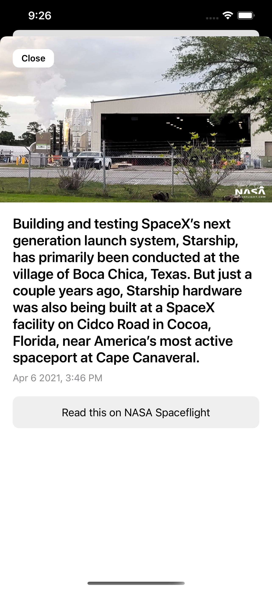
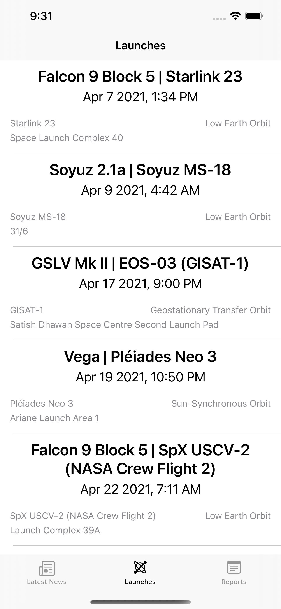
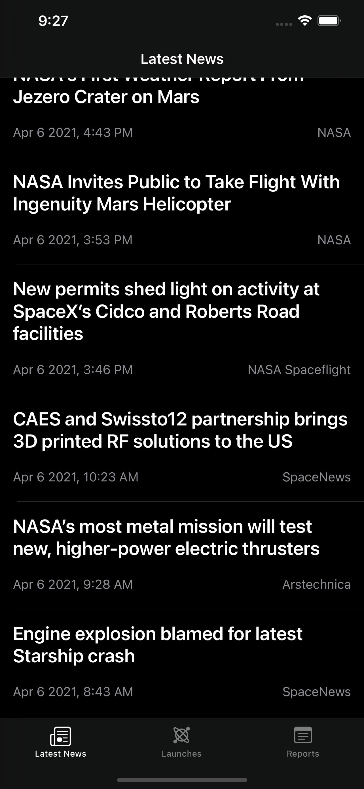

# Spacefy

This is an app to see related news about space and upcoming launches.

 

The app consumes [The Devs Space API](https://thespacedevs.com/snapi) to fetch all data.

## Libraries in use:

* [Alamofire](https://github.com/Alamofire/Alamofire)
* [JGProgressHUD](https://github.com/JonasGessner/JGProgressHUD)
* [Bagel](https://github.com/yagiz/Bagel)

All the views are made with view code, no storyboards used!

As soon as more features are added, this readme will be updated.
